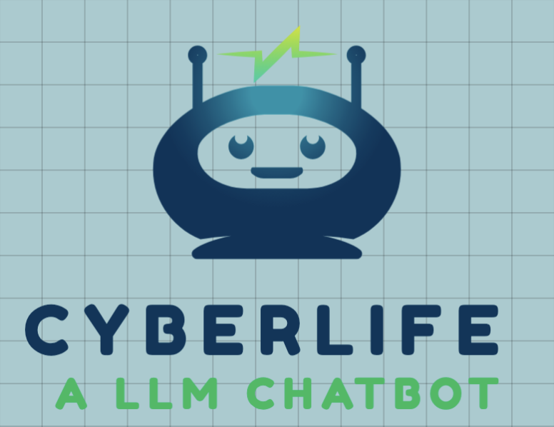

# CyberLife


<p align="center">
  <a href="https://github.com/ZHymLumine/CyberLife/stargazers"></a>
  
  <a href="./LICENSE"></a>
</p>


---

## [Chinese](README.md)

### Introduction🔎

CyberLife is a chatbot implemented using LLM (Language Learning Model) and TTS (Text-to-Speech), exploring authentic chat experiences.

This project uses LangChain as the main framework for LLM, and TTS supports vits, edge-tts.

The language models supported include:
- ChatGPT
- Claude

### Features
✅ Predefined Thought Chains: Allows AI to carry out logical thinking and make decisions. For example, adding Emojis in texts, sending stickers, and so on.

✅ Local Memory Database: Automatically summarizes the dialogue content and imports it into the memory database. It introduces context based on user's questions, thus achieving long-term memory. Also supports bulk import of memories to enrich and control the characterization.

✅ Vector Database: Summarizes the dialogue content and uploads it to the Pinecone database.

✅ Reality Perception: AI can perceive real time and simulate its own state and behavior, such as sleeping at night, and will have corresponding feedback if the user replies after a long time (this performance is currently unstable).

✅ Internet Search: Constructs search decisions independently based on user information and introduces context.

✅ Characterization Templates, Custom Characterization.

✅ edge-tts, azure voice services support.

⬜ vits, emotion-vits support.

⬜ live2d support.

⬜ GUI support.

⬜ Support for multiple language text-to-speech input and output.

⬜ Robot deployment.

⬜ Emoticon support.

⬜ AI Drawing Support: introduces drawing into the thought chain, allowing AI to generate images, such as AI selfies."

### Installation💻

Python version：3.10.10

use conda:
```powershell
git clone https://github.com/ZHymLumine/CyberLife.git
cd CyberLife
conda create --name CyberLife python=3.10.10
conda activate CyberLife
pip install -r requirements.txt
```

#### ffmpeg installation
Installation of ffmpeg is required to support the sending of audio in any format.

Mac: [Install ffmpeg on Mac OSX](https://macappstore.org/ffmpeg/) or run following commands at terminal
```
/bin/bash -c "$(curl -fsSL https://raw.githubusercontent.com/Homebrew/install/HEAD/install.sh)"
echo 'eval "$(/opt/homebrew/bin/brew shellenv)"' >> ~/.zprofile
brew install ffmpeg
```

Windows: [Download FFmpeg](https://ffmpeg.org/download.html#build-windows)

#### Memory Database Vector Computation Model
In order to support local text vector computation, a text embedding model needs to be introduced. Here we use [Sentence Transformer](https://github.com/UKPLab/sentence-transformers)

Firstly, download the model, then unzip it to the `st_model` folder in the root directory. If it does not exist, please create it manually.

Configuration✏️

Configure according to `template.ini`, rename to `config.ini` after configuration.

Large Language Model Configuration
OpenAI: `openai_key` needs to be configured.
Claude: `user_oauth_token` and `bot_id` need to be configured, for details refer to Claude API Integration Tutorial


#### Pinecone
Since the free version only supports the insertion of vectors with an id field encoded in ASCII, the summarized dialogue needs to be translated into English. Use a prompt to let the large language model translate (this part cannot be stably translated into English when using the ChatGPT experiment)
So we choose to call the Baidu translation API, for details refer to [Baidu Translation API Official Integration Document](https://fanyi-api.baidu.com/doc/13)
Configure `appid` and `secret key` in `config.ini`.

#### Character Prompt Configuration
Write according to `presets/charactor/template.txt`, drop the well-written character prompt into the `presets/charactor` directory, then fill in the filename (excluding the extension) in the `charactor` field in the `config.ini` configuration file.

The memory setting is also dropped into the `presets/charactor directory`. Separate multiple memory sections with blank lines, and fill in the `memory` field in the configuration file.

#### Internet Search Configuration
Register and create an API key in [Google Serper](https://serper.dev/), configure and enable it in `config.ini`. Google Serper allows 1000 free calls, which can be used for a long time in actual testing.

Due to the limitation of context length, currently, not much content is introduced from the search, only simple factual information can be obtained.

#### Usage🎉
Just run main.py"

```powershell
conda activate CyberLife
python main.py

### Acknowledge
- CyberWaifu(https://github.com/Syan-Lin/CyberWaifu)
```

